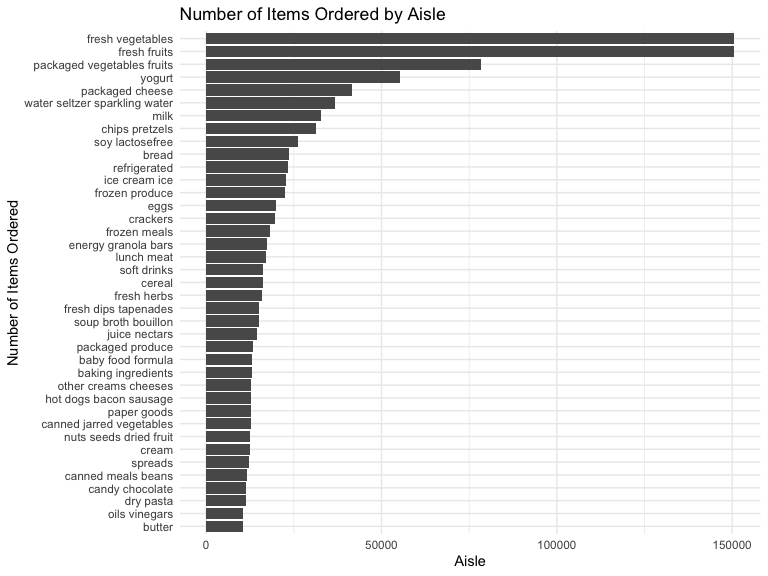
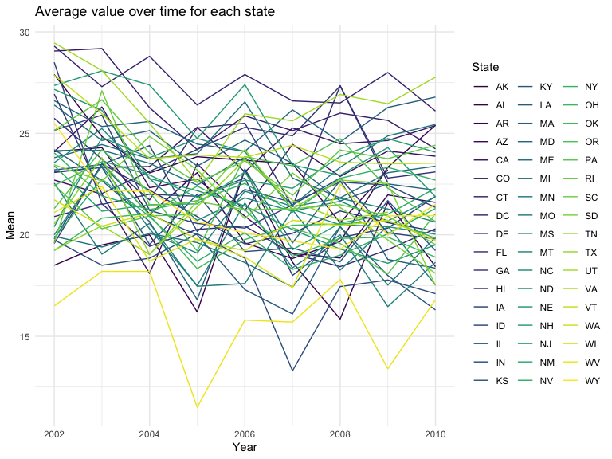
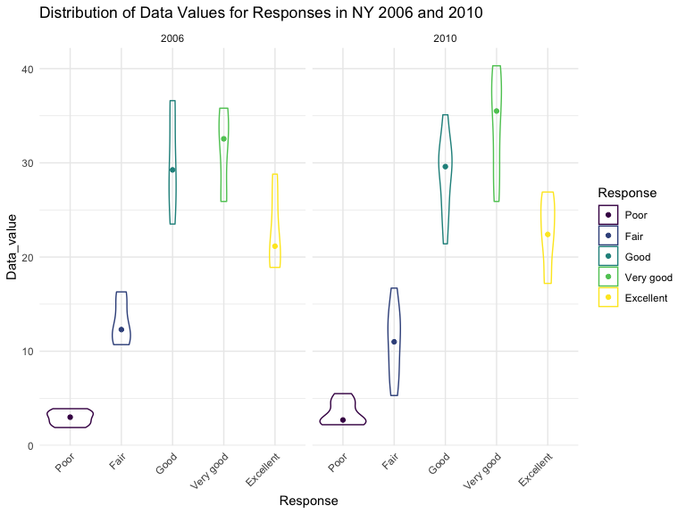
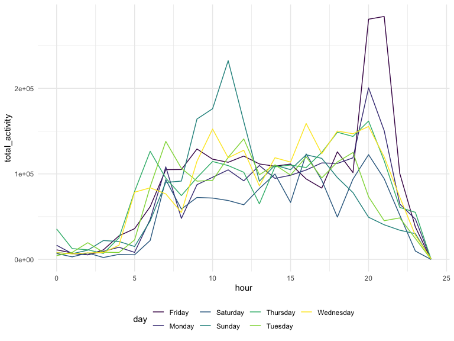

p8105\_hw3\_dna2118
================
Dionna Attinson
10/10/2019

## Problem 1

#### First, we will load the instacart data

``` r
library(p8105.datasets)
data("instacart")
```

#### Next, we will group the data and count the number of aisles. We will then arrange the dataset to see which aisles have the most items ordered from them.

``` r
instacart %>% 
  group_by(aisle) %>% 
  count(aisle) %>% 
  arrange(desc(n))
```

    ## # A tibble: 134 x 2
    ## # Groups:   aisle [134]
    ##    aisle                              n
    ##    <chr>                          <int>
    ##  1 fresh vegetables              150609
    ##  2 fresh fruits                  150473
    ##  3 packaged vegetables fruits     78493
    ##  4 yogurt                         55240
    ##  5 packaged cheese                41699
    ##  6 water seltzer sparkling water  36617
    ##  7 milk                           32644
    ##  8 chips pretzels                 31269
    ##  9 soy lactosefree                26240
    ## 10 bread                          23635
    ## # … with 124 more rows

#### We have 134 isles in the dataset. The aisles that are the most items ordered from are the fresh vegetables and fresh fruits, respectively.

``` r
instacart %>% 
  count(aisle) %>%
  filter (
   n > 10000
  ) %>%
 ggplot(aes(y= n, x=reorder(aisle, n))) +
 geom_bar (stat = "identity") + coord_flip() +
 labs(
  title = "Number of Items Ordered by Aisle",
  x = "Number of Items Ordered",
  y = "Aisle") 
```



#### Now, we will make a table showing the three most popular items in each of the aisles “baking ingredients”, “dog food care”, and “packaged vegetables fruits”. We also included the number of times each item was ordered. We will then make a (2 x7) table showing the mean hour of the day at which Pink Lady Apples and Coffee Ice Cream are ordered on each day of the week.

``` r
instacart %>% 
  filter(aisle %in% c("baking ingredients", "dog food care", "packaged vegetables fruits")) %>%
  group_by(aisle, product_name) %>% 
  summarize(n=n()) %>%
  filter(min_rank(desc(n)) <4) %>% 
  knitr::kable(col.names = c("Aisle",
                             "Product Name", 
                             "Number of Orders"))
```

| Aisle                      | Product Name                                  | Number of Orders |
| :------------------------- | :-------------------------------------------- | ---------------: |
| baking ingredients         | Cane Sugar                                    |              336 |
| baking ingredients         | Light Brown Sugar                             |              499 |
| baking ingredients         | Pure Baking Soda                              |              387 |
| dog food care              | Organix Chicken & Brown Rice Recipe           |               28 |
| dog food care              | Small Dog Biscuits                            |               26 |
| dog food care              | Snack Sticks Chicken & Rice Recipe Dog Treats |               30 |
| packaged vegetables fruits | Organic Baby Spinach                          |             9784 |
| packaged vegetables fruits | Organic Blueberries                           |             4966 |
| packaged vegetables fruits | Organic Raspberries                           |             5546 |

``` r
instacart %>% 
  filter(product_name %in% c("Pink Lady Apples", "Coffee Ice Cream")) %>%
  group_by(product_name, order_dow) %>% 
  summarize(mean = mean(order_hour_of_day)) %>% 
  pivot_wider(
   names_from = "order_dow", 
   values_from = "mean") %>% 
   knitr::kable(col.names = c("Product Names",
                             "Sunday",
                             "Monday",
                             "Tuesday", 
                             "Wednesday",
                             "Thursday",
                             "Friday",
                             "Saturday"))
```

| Product Names    |   Sunday |   Monday |  Tuesday | Wednesday | Thursday |   Friday | Saturday |
| :--------------- | -------: | -------: | -------: | --------: | -------: | -------: | -------: |
| Coffee Ice Cream | 13.77419 | 14.31579 | 15.38095 |  15.31818 | 15.21739 | 12.26316 | 13.83333 |
| Pink Lady Apples | 13.44118 | 11.36000 | 11.70213 |  14.25000 | 11.55172 | 12.78431 | 11.93750 |

## Problem 2

#### First, we will load the BRFSS data

``` r
devtools::install_github("p8105/p8105.datasets")
```

    ## Skipping install of 'p8105.datasets' from a github remote, the SHA1 (412759e3) has not changed since last install.
    ##   Use `force = TRUE` to force installation

``` r
library(p8105.datasets)
data("brfss_smart2010")
```

#### Now, we will will clean the data and only include responses from “Excellent” to “Poor” and arrange the responses from Poor to Excellent

``` r
brfss = 
brfss_smart2010 %>%
  filter(Topic %in% "Overall Health") %>% 
  filter(Response %in% c("Excellent", "Very good", "Good", "Fair", "Poor")) %>% 
  mutate (Response = ordered(Response, c("Poor","Fair", "Good","Very good","Excellent"))) %>%
  mutate(
  Response = factor(Response, levels = c("Poor","Fair","Good","Very good","Excellent"))) %>% 
  arrange(Response) 
```

#### In 2002, 36 states were observed at 7 or more locations.

``` r
brfss %>% 
 filter(Year == "2002") %>% 
  group_by(Year, Locationabbr) %>% 
  summarize(n=n()) %>% 
  filter(n >= 7)
```

    ## # A tibble: 36 x 3
    ## # Groups:   Year [1]
    ##     Year Locationabbr     n
    ##    <int> <chr>        <int>
    ##  1  2002 AZ              10
    ##  2  2002 CO              20
    ##  3  2002 CT              35
    ##  4  2002 DE              15
    ##  5  2002 FL              35
    ##  6  2002 GA              15
    ##  7  2002 HI              20
    ##  8  2002 ID              10
    ##  9  2002 IL              15
    ## 10  2002 IN              10
    ## # … with 26 more rows

#### In 2010, 45 states were observed at 7 or more locations.

``` r
brfss %>% 
 filter(Year == "2010") %>% 
  group_by(Year, Locationabbr) %>% 
  summarize(n=n()) %>% 
  filter(n >= 7)
```

    ## # A tibble: 45 x 3
    ## # Groups:   Year [1]
    ##     Year Locationabbr     n
    ##    <int> <chr>        <int>
    ##  1  2010 AL              15
    ##  2  2010 AR              15
    ##  3  2010 AZ              15
    ##  4  2010 CA              60
    ##  5  2010 CO              35
    ##  6  2010 CT              25
    ##  7  2010 DE              15
    ##  8  2010 FL             205
    ##  9  2010 GA              20
    ## 10  2010 HI              20
    ## # … with 35 more rows

#### Next, we will construct a dataset that is limited to Excellent responses, and contains, year, state, and a variable that averages the data\_value across locations within a state.

``` r
new_brfss =
brfss %>% 
filter(Response == "Excellent") %>% 
group_by(Year,Locationabbr) %>% 
summarize(mean=mean(Data_value))
```

#### Below is a “spaghetti” plot of this average value over time within a state.

``` r
new_brfss %>% 
   ggplot(aes(x = Year, y = mean, group = Locationabbr, color = Locationabbr)) + 
   geom_line() +  
  viridis::scale_color_viridis(
    name = "State", 
    discrete = TRUE, 
    option = "viridis"
  ) + 
  theme_minimal() +
  labs(
    x = "Year",
    y = "Mean", 
    title = "Average value over time for each state"
  )
```



#### Below is a two-panel plot showing, for the years 2006, and 2010, distribution of data\_value for responses (“Poor” to “Excellent”) among locations in NY State.

``` r
brfss %>% 
  filter (Year %in% c("2006", "2010"), Locationabbr == "NY") %>% 
  ggplot (aes(x = Response, y = Data_value, color = Response)) + geom_violin(alpha = .05) +     stat_summary(fun.y= median, geom = "point") +
  labs(
  title = "Distribution of Data Values for Responses in NY 2006 and 2010",
  x = "Response",
  y = "Data_value") +
  viridis::scale_color_viridis(
    name = "Response", 
    discrete = TRUE, 
    option = "viridis"
  ) + 
  theme_minimal() + 
  theme(axis.text.x = element_text(angle = 45, hjust = 1)) +
  facet_grid(~Year)
```



## Problem 3

#### First, we will load and tidy the data and create the appropriate variables.We will then aggregate accross minutes to create a total activity variable for each day, and create a table showing these totals.

\#\#\#\#Of note, some trends include that in weeks 4 and 5, activity was
lower on Saturdays in comparison to the rest of the week.

``` r
Accel_data = read_csv(file = "./Data/accel_data.csv") %>% 
janitor::clean_names() %>% 
mutate(
Day_of_Week = if_else(day %in% c("Saturday","Sunday"), "Weekend", "Weekday")) %>% 

pivot_longer(
activity_1:activity_1440,
names_to = "Minute",
names_prefix = "activity_",
values_to = "Activity") %>%
mutate( week= as.integer(week),
day_id= as.integer(day_id),
day= as.character(day),
Day_of_Week=as.character(Day_of_Week),
Activity=as.numeric(Activity),
Minute=as.numeric(Minute))
```

    ## Parsed with column specification:
    ## cols(
    ##   .default = col_double(),
    ##   day = col_character()
    ## )

    ## See spec(...) for full column specifications.

``` r
Accel_data %>% 
group_by(week, day) %>% 
summarise (total_activity = sum(Activity)) %>%
knitr::kable(col.names= c("Week", "Day of the Week", "Total Activities"))
```

| Week | Day of the Week | Total Activities |
| ---: | :-------------- | ---------------: |
|    1 | Friday          |        480542.62 |
|    1 | Monday          |         78828.07 |
|    1 | Saturday        |        376254.00 |
|    1 | Sunday          |        631105.00 |
|    1 | Thursday        |        355923.64 |
|    1 | Tuesday         |        307094.24 |
|    1 | Wednesday       |        340115.01 |
|    2 | Friday          |        568839.00 |
|    2 | Monday          |        295431.00 |
|    2 | Saturday        |        607175.00 |
|    2 | Sunday          |        422018.00 |
|    2 | Thursday        |        474048.00 |
|    2 | Tuesday         |        423245.00 |
|    2 | Wednesday       |        440962.00 |
|    3 | Friday          |        467420.00 |
|    3 | Monday          |        685910.00 |
|    3 | Saturday        |        382928.00 |
|    3 | Sunday          |        467052.00 |
|    3 | Thursday        |        371230.00 |
|    3 | Tuesday         |        381507.00 |
|    3 | Wednesday       |        468869.00 |
|    4 | Friday          |        154049.00 |
|    4 | Monday          |        409450.00 |
|    4 | Saturday        |          1440.00 |
|    4 | Sunday          |        260617.00 |
|    4 | Thursday        |        340291.00 |
|    4 | Tuesday         |        319568.00 |
|    4 | Wednesday       |        434460.00 |
|    5 | Friday          |        620860.00 |
|    5 | Monday          |        389080.00 |
|    5 | Saturday        |          1440.00 |
|    5 | Sunday          |        138421.00 |
|    5 | Thursday        |        549658.00 |
|    5 | Tuesday         |        367824.00 |
|    5 | Wednesday       |        445366.00 |

#### Next, we will make a single-panel plot that shows the 24-hour activity time courses for each day and use color to indicate day of the week. Here, we see that overall activity increased as the hour of the day progressed and declined significantly at the very end of the 24-hour period. We see that on Fridays, activity spiked the most during the end of of the 24-hour period.

``` r
Accel_data %>%
mutate(
hour = Minute %/% 60) %>% 
group_by(day, hour) %>% 
summarise (total_activity = sum(Activity)) %>% 
ggplot(aes(x=hour, y=total_activity)) + geom_line(aes(color=day))
```


